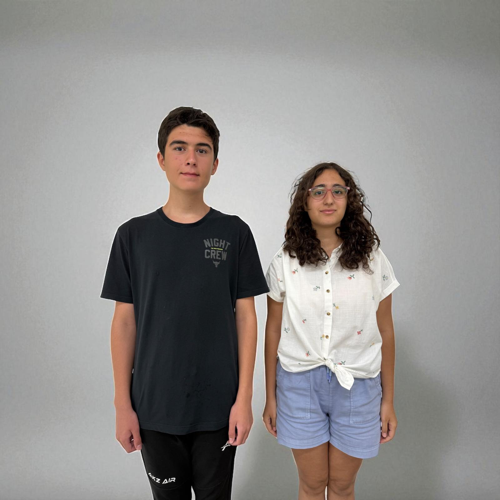
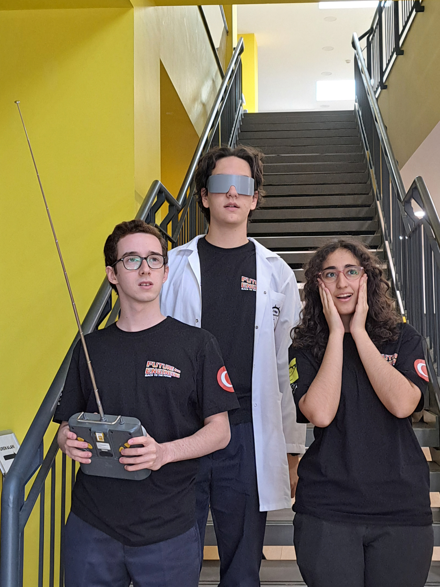
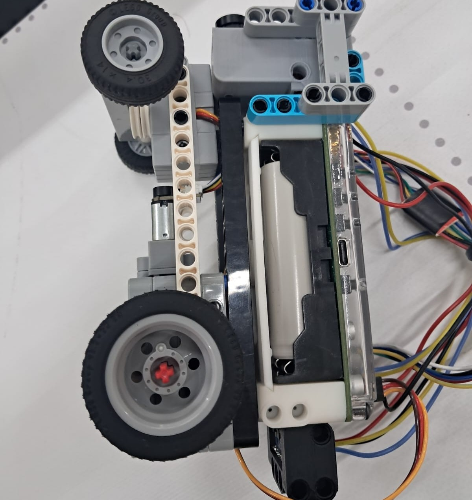
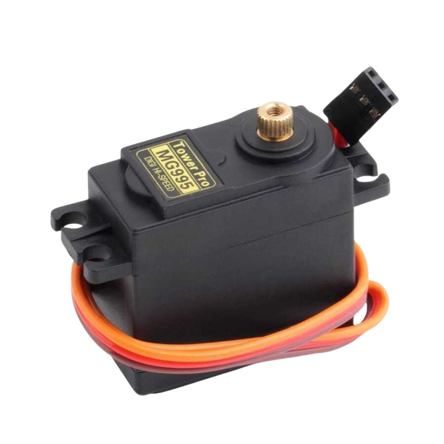
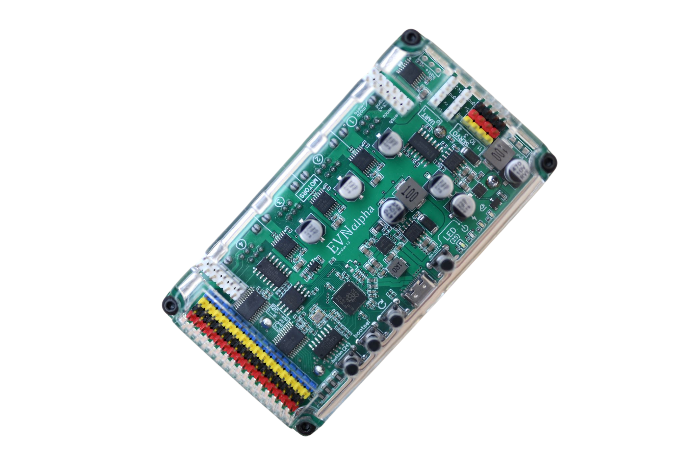
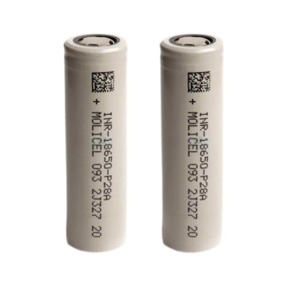
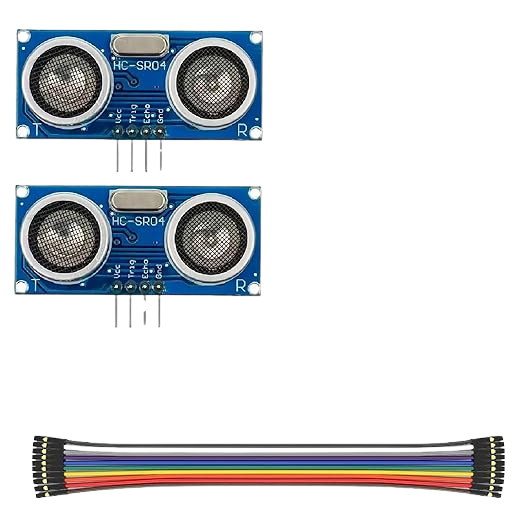
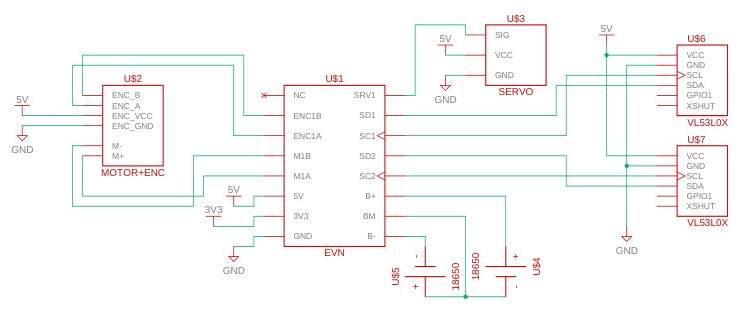
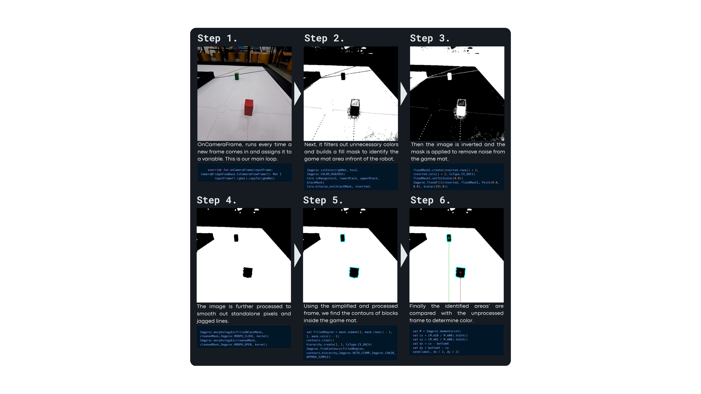
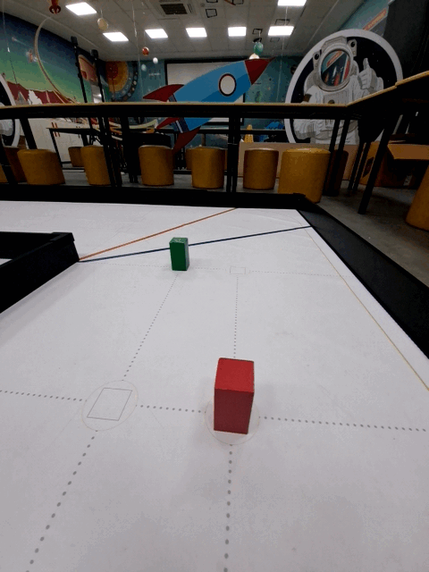

Team BACK TO THE FUTURE - WRO® 2025 Future Engineers
===
<table border="0">
  <tr border="0">
    <td  border="0" colspan="2">
      
    </td>
  </tr>
  <tr border="0">
    <td width="65%"  border="0">
      
      
    </td>
    <td valign="top" style="padding-left: 0px;" border="0">
        This repository details team <em>Back To The Future</em>'s building and programming process in the 2025 WRO Future Engineers Competition. 
      We are team <em> Back To The Future</em>, two students who are passionate about technology and robotics. For this competition we built an autonomous vehicle. We worked after school and on weekends. Through this competition, we learned how to work as a team and solve problems related to robotics.
       

        <strong>Team Members:</strong>
      <ul>
        <li>Ayça Nisa Çerçi, 16</li>
        <li>Batuhan Pekcan, 15</li>
      </ul>
      

    </td>
  </tr>
</table>

## Contents
* `models` is for the 3D files we used to print our parts
* `other` includes other files which can be used to understand how to prepare the vehicle for the competition. It includes documentations, datasets, hardware specifications, communication protocols,  descriptions etc.
* `schemes` contains schematic diagrams of the electromechanical components illustrating all the elements (electronic components and motors) used in the vehicle and how they connect to each other.
* `src` contains code of control software for all components which were programmed to participate in the competition
* `t-photos` contains photos of the team and logos
* `v-photos` contains 6 photos of the vehicle from various angles
* `video` contains the video.md file with the link to our YouTube channel and the respective videos
---
## Content of README
- [Hardware](#hardware)
  - [Electronic Components](#electronic-components)
  - [Mobility Management](#mobility-management)
    - [Chassis and Design](#chassis-and-design)
    - [Locomotion](#locomotion)
    - [Steering](#steering)
  - [Power and Sense Management](#power-and-sense-management)
    - [Power and Wiring](#power-and-wiring)
    - [Sensors](#sensors)
- [Software and Control](#software-and-control)
<!--  - [Vehicle Assembly](#vehicle-assembly)  -->
---

## Hardware      
This section discusses all the parts used in the vehicle including the motors, sensors, controllers, chassis, mechanisms and other elements.
<table style="width: 100%">
  <tr>
    <td rowspan="2" style="width: 50%; vertical-align: top;">
       
    </td>
    <td width="45%"; vertical-align: top;">
       
    </td>
  </tr>
  <tr>
    <td style="vertical-align: top;">
       
    </td>
  </tr>
</table>

### Electronic Components
<table border="1" cellpadding="12" cellspacing="0">
  <thead>
    <tr>
      <th>Component</th>
      <th>Description / Link</th>
      <th>Image</th>
      <th>Price</th>
    </tr>
  </thead>
  <tbody>
    <tr>
      <td>Motor</td>
      <td><a href="https://www.pololu.com/product/4755">Pololu PL-4755</a></td>
      <td></td>
      <td>$90</td>
    </tr>
    <tr>
      <td>Servo Motor</td>
      <td><a href="https://www.ebay.com/itm/192002483556">Tower Pro MG995 (270 degrees)</a></td>
      <td></td>
      <td>$12</td>
    </tr>
  <tr>
    <td>Arduino Nano</td>
      <td><a href="https://www.amazon.com/Arduino-Nano-Every-headers-Mounted/dp/B07WWK29XF/ref=sr_1_6?dib=eyJ2IjoiMSJ9.6QPRL9EGieCqVheJYNSvYLiNSaIKqAuyrl-iTXMnEEFxjRF91-4yBiNZ6nyKh5ycpBOX44QOmPRK7fL3HVLo2QC2_QmAm-7GL2P5Z-mCouxmwDNTEQJyOoxRi9AEIPjNBUgLOiy90Prhtw6UN2BxDhMu7ViOaG3R5O15E3tL0jTF4MEzSOtHVFYsoVMhNjp9DDzrsWomxCVR0Mx8RJisD0e4Xk5l8poPY9SfpBqtgK8.0iYflxus7jVqie86k-tM8DtWQV5-URD3P1OsP7q5PeI&dib_tag=se&keywords=arduino+nano&qid=1748520860&sr=8-6">ABX00033</a></td>
      <td></td>
      <td>$18</td>
    <tr>
      <td>Motor Controller</td>
      <td><a href="https://coresg.tech/product/evn-alpha/">EVN Alpha</a></td>
      <td></td>
      <td>$168</td>
    </tr>
    <tr>
      <td>Battery</td>
      <td><a href="https://www.pilpaketi.com/molicel-inr18650-p28a-2800-mah-35a-li-ion-pil?srsltid=AfmBOoq0NI6NCh02JlGpFI8KTAQyYEYrH5VP3xPdYOHkjVYT9HXYP0vB">Molicel 35A Li-ion battery</td>
      <td>
      <td>$10x2</td>
    </tr>
    </tr>
      <td>Ultrasonic Sensor</td>
      <td><a href = "https://www.amazon.com/WWZMDiB-HC-SR04-Ultrasonic-Distance-Measuring/dp/B0B1MJJLJP/ref=sr_1_1_sspa?dib=eyJ2IjoiMSJ9.E2SIkElJhtFWCJCHL5Q6YwwtxyRhETnroFHfs4vAAJOjcW1L9dEwbj7bGniy3Pzy6L27ZFLNRdwTI4FVcgYKtnYKHKahio9ZyZa72jk1DZa4pvnNpjMaBYwEafzMDsrU1DWy1_HOlRrWNFoFsfeGA-Seq8DXEae_iaU754X9KoDaoDFvAMEwwrnDM6CdTvT420uo2v9w7A_ooCAaUVxTJlxzYv8n0E07VG6Ycfd5lS8.OEUDh4z78lpkOdU7BLjVaoVRoDB7bjIllFkaE5OLfrQ&dib_tag=se&keywords=Ultrasonic+Sensors&qid=1748517699&sr=8-1-spons&sp_csd=d2lkZ2V0TmFtZT1zcF9hdGY&psc=1"</td>HC-SR04</a></td>
      <td></td>
      <td>$7x2</td>
    <tr>
      <td>Time of Flight Sensor</td>
      <td><a href="https://www.amazon.com/dp/B099N2JW89">VL53L0X</a></td>
      <td></td>
      <td>$9x2</td>
    </tr>
    <tr>
      <td>Camera and Processor</td>
      <td><a href="https://www.amazon.com/dp/B09XP9FX25?th=1">Samsung Galaxy A53 5G</a></td>
      <td></td>
      <td>$142</td>
    </tr>
    <tr>
      <td colspan="3"><strong>Total Cost</strong></td>
      <td><strong>$928</strong></td>
    </tr>
  </tbody>
</table>

## Mobility Management
This section contains information about the vehicle's movement.

### Chassis and Design
<table border="0">
  <tr>
    <td width=%20>

</td><td width=%80>The vehicle's chassis was designed completely by our team using Autodesk Fusion® program. It was designed to have a rectangular shape with a tapered front to increase steering range. It has cutouts for the motor, servo, sensors, cables and screw holes for mounting parts with M3 screws and LEGO® TECHNIC compatible pin holes to make assembly easier.
It measures 171.2 mm in length, 100 mm in width and 25.7 mm in height, without the steering assembly.
It was 3D printed with <a href=https://store.creality.com/products/hyper-series-pla-3d-printing-filament-1kg>gray Hyper PLA filament</a> on Ender 3 V3. The chassis has a mostly flat top side to increase 3D printing quality.
The chassis was designed to fit all the components on one layer. It is also directly connected to the steering mechanism's main (stationary) part.
The front and back tires used are LEGO® #39367pb02 wheels. They were chosen because they have smaller contact area with the ground thus increasing predictability and decreasing slippage.</td>
  </tr>
</table>

### Locomotion
The robot moves forward-backward with a rear wheel drive (RWD) mechanism. The wheels are connected to the motor with a LEGO® differential (#65413, #65414, 5x #6589) to prevent slipping of wheels while cornering.
The back axle is held in place by the chassis' supporting legs.
<table border="0">
  <tr>
    <td width=%20></td><td>The motor driving the differential is a powerful 12V brushed DC gearmotor with a 102.08:1 metal gearbox and an integrated quadrature encoder with a resolution of 64 counts per revolution (CPR) of the motor shaft and 6533 CPR of the gearbox’s output shaft. The gearbox is composed mainly of spur gears, but it features helical gears for the first stage for reduced noise and improved efficiency. These units have a 16 mm-long, 6 mm-diameter D-shaped output shaft. 
A gear compatible with the motor and the differential's gears was 3D printed.
</td>
  </tr>
</table>

| Motor Specs | Values |
| --- | --- |
| Stall Current | 3.5 A |
| No Load Current | 100 mA |
| No Load Speed | 65 rpm |
| Stall Torque | 22 kg cm |

*Values were measured and/or calculated at ~8V*

### Steering
<table>
  <tr>
    <td>
    </td><td>The steering mechanism was designed by our team using Autodesk Fusion® to make adjustments easier. It was designed with respect to <a href=https://en.wikipedia.org/wiki/Ackermann_steering_geometry>Ackermann Steering Geometry</a> to increase turning predictability and accuracy. The design has been optimised in regards to wheel base and vehicle length to minimise slipping. It is mounted to the main steering part on the chassis using M3 screws and lock nuts.
    </td>
  </tr>
</table>

<table>
  <tr>
    <td>To control steering we use a `Tower Pro MG995`. The MG995 servo motor offers an increase in speed, tension and precision over the SG90 and MG90S micro servo motors. This high-speed standard servo   motor can rotate 270 degrees.
The linear extension part was screwed on the servo's output shaft. Steering control rod was screwed on the hole furthest from the shaft.
With the mechanism, the steering assembly can turn -25 to +25 degrees relative to the servo. This was enough to maneuver around the obstacles, considering the small turning radius of the vehicle (~42 cm).
</td><td width="%30"></td>
  </tr>
</table>

## Power and Sense Management
This section discusses the powering, wiring and sensing of the vehicle.

### Power and Wiring

This schematic illustrates the core electromechanical connections for an autonomous vehicle's control system. The system is built around the **EVN Alpha board (US1)**, which interfaces with a **DC motor with encoder (US2)** for locomotion and a **servo motor (US3)** for steering. Power is supplied by two **18650 batteries** in series, regulated to 5V and 3.3V for different components. The EVN board receives encoder signals from the motor and provides motor and servo control outputs. Additionally, two **VL53L0X Time-of-Flight sensors (US6 and US7)** are used for distance measurement, connected via I2C. Each sensor includes an **XSHUT** pin to allow individual addressing, enabling them to coexist on the same bus. The circuit is designed to ensure coordinated motor control, steering, and real-time distance sensing, supporting autonomous navigation.

### Sensors
Our vehicle uses the `Samsung Galaxy A53 5G`'s cameras for visual input during both the open and obstacle rounds. Specifically, we access the 12MP (F2.2) ultra-wide 0.5x zoom rear camera to capture images and video frames, as it provides a broader field of view compared to the main camera, allowing the vehicle to better detect lane markings and traffic signs. To determine its heading and keep track of turns during navigation, we utilize the phone's `GAME_ROTATION_VECTOR` sensor. This sensor provides smooth and drift-free measurements of the azimuth (yaw) angle, which is essential for accurately detecting and counting turns in real time, especially during sequences where the vehicle must follow complex paths or respond to directional cues.

To enable accurate distance sensing across different competition scenarios, we integrated two types of sensors into our vehicle. During the open round, we employed a VL53L0X infrared Time-of-Flight (ToF) sensor, which provides precise distance measurements by calculating the time it takes for an emitted light pulse to reflect off an object and return to the sensor. This allows the vehicle to maintain proper alignment and stopping distance along the route. In contrast, for the obstacle round, we used an HC-SR04 ultrasonic sensor, which determines distance by measuring the echo time of ultrasonic sound waves. This sensor is particularly effective for detecting larger, irregularly shaped obstacles and is well-suited for dynamic environments where quick reaction to unexpected objects is critical. The combination of these sensors ensured our vehicle maintained spatial awareness and navigational precision in both rounds.

## Software and Control
This section discusses the control software for both rounds. It contains codes for each round. Both the open and obstacle rounds contain the turn direction identification code that uses the blue/orange lines and logic to count turns using the smartphone's gyroscope. We only use the traffic sign identification on the obstacle round.

### Image Processing
We use many steps to filter and manipulate the camera input to achieve our goal. Here you can see a simplified visualisation of what happens behind scenes.

These are the broad steps of our process to identify the traffic signs.
<table border="0">
  <tr>
    <td width="60%"></td>
    <td>We use OpenCV for processing the images. First we take the frame from the camera at 15fps and 640x480px resolution. Then we perform a flood fill from the bottom middle pixel of the screen while thresholding black and blue pixels to isolate the game mat. Then we find all the contours of this mask and filter out the ones that are on the outside edge and thereby are left with the borders of the traffic light rectangles. After finding the rectangles, we calculate their centres and send the distance between them and the bottom middle pixel to the EVN.</td>
  </tr>
</table>

### EVN Alpha
For controlling the DC Motor With Encoder and the Servo Motor, our vehicle utilizes an EVN Alpha, based on the [RP2040](https://www.raspberrypi.com/products/rp2040/) microcontroller designed by Raspberry Pi. It features 4 motor drivers with encoder inputs, 2 UART controllers, 16 I2C ports (achieved with multiplexing of the 2 I2C controllers on RP2040), 4 Servo controllers and a USB-C port for charging and data transfer. It can be programmed with the [Arduino IDE](https://www.arduino.cc/en/software/), after installing the [Arduino Pico Core](github.com/earlephilhower/arduino-pico/) and [EVN Library](https://github.com/EVNdevs/EVN-arduino).

### Smartphone
Our vehicle uses the Samsung Galaxy A53 5G as the main processing unit and vision system. It runs the custom-built Android app responsible for all high-level decision-making. The smartphone's 12MP ultra-wide rear camera provides a broad field of view for traffic sign recognition and lane detection. Additionally, we leverage its GAME_ROTATION_VECTOR sensor to track yaw orientation and count turns accurately, enabling navigation through the open and obstacle rounds. The phone connects to the EVN Alpha via USB and communicates using a custom serial protocol. This setup eliminates the need for additional processing hardware, reducing complexity and cost.

<!-- ## Vehicle Assembly -->  
