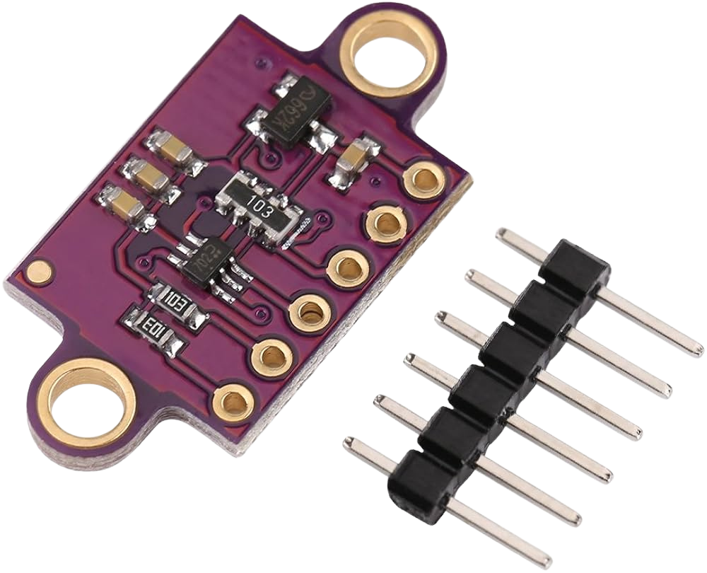

Engineering Documentation  
===

## Contents

* `t-photos` contains 2 photos of the team (an official one and one funny photo with all team members)
* `v-photos` contains 6 photos of the vehicle (from every side, from top and bottom)
* `video` contains the video.md file with the link to a video where driving demonstration exists
* `schemes` contains one or several schematic diagrams in form of JPEG, PNG or PDF of the electromechanical components illustrating all the elements (electronic components and motors) used in the vehicle and how they connect to each other.
* `src` contains code of control software for all components which were programmed to participate in the competition
* `models` is for the files for models used by 3D printers, laser cutting machines and CNC machines to produce the vehicle elements. If there is nothing to add to this location, the directory can be removed.
* `other` is for other files which can be used to understand how to prepare the vehicle for the competition. It may include documentation how to connect to a SBC/SBM and upload files there, datasets, hardware specifications, communication protocols descriptions etc. If there is nothing to add to this location, the directory can be removed.
  ## Team Members
  *  `Ayca Nisa Cerci`, `16`
  * `Tibet Ozkarslioglu`,`17`
  * `Mert Ata Makinaci`, `16`

## Content of README
- [Hardware](#hardware)
  - [Components](#components)
  - [Mobility Management](mobility-management)
    - [Chassis](chassis)
    - [Design](design)
    - [Motors](motors)
- [Software](#software)
- [VehicleAssembly](vehicle-assembly)
## Hardware      
### Components
<!DOCTYPE html>
<html lang="en">
<head>
    <meta charset="UTF-8">
    <meta name="viewport" content="width=device-width, initial-scale=1.0">
    <title>Motor Components Table</title>
    
</head>
<body>

<h2>Motor Components Table</h2>

<table>
    <thead>
        <tr>
            <th>Component</th>
            <th>Product Link</th>
            <th>Image</th>
            <th>Price</th>
        </tr>
    </thead>
    <tbody>
        <tr>
            <td>Motor with Encoder</td>
            <td><a href="https://www.pololu.com/product/4755">Metal Gearmotor</a></td>
            <td></td>
            <td>90$</td>
        </tr>
        <tr>
            <td>Servo Motor</td>
            <td><a href="https://www.ebay.com/itm/192002483556">Tower Pro MG995 (270 degrees)</a></td>
            <td></td>
            <td>12$</td>
        </tr>
        <tr>
            <td>Motor Controller</td>
            <td><a href="https://coresg.tech/product/evn-alpha/">EVN Alpha</a></td>
            <td></td>
            <td>168$</td>
        </tr>
            <td>Sensor</td>
            <td><a href="https://www.amazon.com/VKLSVAN-Measurements-Breakout-Accurate-Distance/dp/B099N2JW89/ref=sr_1_21?dib=eyJ2IjoiMSJ9.FHoX1s21bwww8-NUEd8BDmuIcVpW6rD7ehPzn9Nrcnr83wpj7UbUi9nTPdVbzD0BZQBe4NcTkUF81jqL1nH1B1oWyGsGmJvVDI9LizHIMgQa-9x9Kawya7KRBut3eaMHHIsh7hhXHszMiLL41TcW_TsiRXD4baq3nEYucGFwMjmp6Hhz-geVCebnKhqtsht6ni7oUUj8yK9zkh-7uDRcyYCAQC9mr7VNeh2rTVr-RnM.0Bbbq1BQlA3MnEtffctAFpx3Wft-0tIANuMAgv0CXwg&dib_tag=se&keywords=time+of+flight+sensor&qid=1748441943&sr=8-21">Time Of Flight Sensor</a></td>
            <td></td>
            <td>9$</td>
        <tr>
            <td>Camera and Processor</td>
            <td><a href="https://www.amazon.com/SAMSUNG-Smartphone-Unlocked-Android-Battery/dp/B09XP9FX25?th=1">Samsung Galaxy A53 5G</a></td>
            <td></td>
            <td>142$</td>
        </tr>
        <tr>
            <td colspan="3"><strong>Total cost:</strong></td>
            <td><strong>421$</strong></td>
        </tr>
    </tbody>
</table>

</body>
</html>

## Mobility Management

 ## Chassis
 
 ## Design
 ## Motors
 Our robot uses `Pololu Metal Gearmotor`. This gearmotor is a powerful 12V brushed DC motor with a 30:1 metal gearbox and an integrated quadrature encoder with a resolution of 64 counts per revolution (CPR) of the motor shaft and 1920 CPR of the gearbox’s output shaft. The gearbox is composed mainly of spur gears, but it features helical gears for the first stage for reduced noise and improved efficiency. These units have a 16 mm-long, 6 mm-diameter D-shaped output shaft.

 To control steering we use a  `Tower Pro MG995`. The MG995 servo motor offers an increase in speed, tension and precision over the SG90 and MG90S micro servo motors. This high-speed standard servo motor can rotate 270 degrees.

 
## Software

## Vehicle Assembly  
