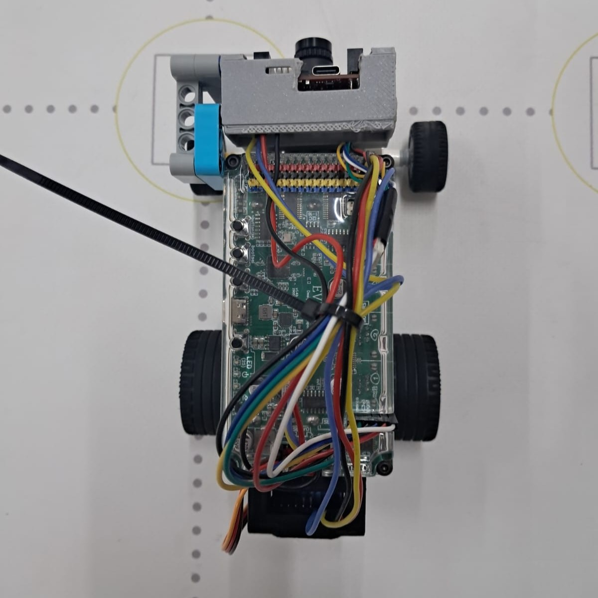

[](/COPYING.gpl)

# Team BACK TO THE FUTURE - WRO® 2025 Future Engineers

<table border="0">
  <tr border="0">
    <td  border="0" colspan="2">
      
    </td>
  </tr>
  <tr border="0">
    <td width="65%"  border="0">
      
      
    </td>
    <td valign="top" style="padding-left: 0px;" border="0">
        This repository details team <em>Back To The Future</em>'s building and programming process in the 2025 WRO Future Engineers Competition. 
      We are team <em> Back To The Future</em>, two students who are passionate about technology and robotics. For this competition we built an autonomous vehicle. We worked after school and on weekends. Through this competition, we learned how to work as a team and solve problems related to robotics.
       </p>
        <strong>Team Members:</strong>
      <ul>
        <li>Ayça Nisa Çerçi, 16</li>
        <li>Batuhan Pekcan, 15</li>
      </ul>
      </p>
    </td>
  </tr>
</table>

[](mailto:backtothefuturefeteamofficial@gmail.com)  [](https://www.youtube.com/@BackToTheFuture-WRO)


# Table of Contents
- [Folder Contents](#folder-contents-)
- [The Challenge](#challenge)
- [Vehicle](#Vehicle)
- [Hardware Components](#Hardware)
- [Power and Sense Management](#power-and-sense-management)
- [Software Components](#Software)
- [Robot Construction Guide](#robot-construction-guide-)
- [Resources](#Resources)
- [License](#License)

# Folder Contents <a class="anchor" id="folder-contents-"></a>
* `models` is for the 3D files we used to print our parts
* `other` includes other files which can be used to understand how to prepare the vehicle for the competition. It includes documentations, datasets, hardware specifications, communication protocols,  descriptions etc.
* `schemes` contains schematic diagrams of the electromechanical components illustrating all the elements (electronic components and motors) used in the vehicle and how they connect to each other.
* `src` contains code of control software for all components which were programmed to participate in the competition
* `t-photos` contains photos of the team and logos
* `v-photos` contains 6 photos of the vehicle from various angles
* `video` contains the video.md file with the link to our YouTube channel and the respective videos

# The Challenge <a class="anchor" id="challenge"></a>

In the **[WRO 2025 Future Engineers – Self-Driving Cars](https://wro-association.org/)** category, teams are tasked with creating a robotic vehicle that can autonomously navigate a changing racetrack. Each round introduces new track layouts, requiring vehicles to adapt in real time.
The competition highlights the full engineering process:

- **Vehicle Design**: Building a functional robot with electromechanical components and advanced steering or motion systems.
- **Obstacle Management**: Applying computer vision, sensor fusion, and motion planning to make real-time decisions.
- **Project Documentation**: Maintaining an engineering journal and sharing designs in a public GitHub repository.

Teams are judged on performance, innovation, reliability, and the clarity of their engineering process, encouraging creativity, teamwork, and STEM skills.

Learn more about the challenge [here](https://wro-association.org/wp-content/uploads/WRO-2025-Future-Engineers-Self-Driving-Cars-General-Rules.pdf).

# Vehicle <a class="anchor" id="Vehicle"></a>
Our robot integrates LEGO components with custom 3D-printed hardware, designed to maximize stability and durability. It features a 3D-printed motor mount and camera holder, integrated with a LEGO-based chassis. For steering, we implemented a simplified Ackermann setup without linkage geometry (reckless steering), allowing the robot to turn easily while keeping the design compact. Our robot is powerized by a [GA12-N20 200RPM](https://www.handsontec.com/dataspecs/GA12-N20.pdf) dc motor and controlled by an [EVNAlpha](https://evn.readthedocs.io/). It uses [OpenMV RT1062](https://openmv.io/products/openmv-cam-rt?srsltid=AfmBOorMjCmNBP1AZA_3V53JQMS-8N7Mg5ljP10ljHe4SLFoCauGWzZN) to locate obstacles, lines and walls. Steering was managed by [GeekServo 2KG Motor](https://kittenbothk-eng.readthedocs.io/en/latest/motors/2kgMotor.html).


## V-Photos <a class="anchor" id="Vphotos"></a>
|  |  | 
| :--: | :--: | 
| *Front* | *Back* |
|  |  | 
| *Left* | *Right* |
|  |  | 
| *Top* | *Bottom* |

<br>

# Hardware Components <a class="anchor" id="Hardware"></a>
This section discusses ...
## Electronic Components
<table border="1" cellpadding="12" cellspacing="0">
  <thead>
    <tr>
      <th>Component</th>
      <th>Description / Link</th>
      <th>Image</th>
      <th>Price</th>
    </tr>
  </thead>
  <tbody>
    <tr>
      <td>Motor</td>
      <td><a href="https://www.aliexpress.us/item/3256805071786531.html?gatewayAdapt=glo2usa4itemAdapt">GA12 N20 Encoder DC Mini Micro Metal Gear DC Motor</td>
      <td></td>
      <td>$7</td>
    </tr>
    <tr>
      <td>Servo Motor</td>
      <td><a href="https://www.robotshop.com/products/geekservo-motor-2kg-compatible-w-lego">GeekServo (360 degrees)</a></td>
      <td></td>
      <td>$10</td>
    </tr>
  <tr>
    <tr>
      <td>Motor Controller</td>
      <td><a href="https://coresg.tech/product/evn-alpha/">EVN Alpha</a></td>
      <td></td>
      <td>$168</td>
    </tr>
    <tr>
      <td>Battery</td>
      <td><a href="https://www.pilpaketi.com/molicel-inr18650-p28a-2800-mah-35a-li-ion-pil?srsltid=AfmBOoq0NI6NCh02JlGpFI8KTAQyYEYrH5VP3xPdYOHkjVYT9HXYP0vB">Molicel 35A Li-ion battery</td>
      <td>
      <td>$10x2</td>
    </tr>
    </tr>
    <tr>
      <td>Camera and Processor</td>
      <td><a href="https://openmv.io/products/openmv-cam-rt?srsltid=AfmBOorMjCmNBP1AZA_3V53JQMS-8N7Mg5ljP10ljHe4SLFoCauGWzZN">OpenMV Cam RT1062</a></td>
      <td></td>
      <td>$120</td>
    </tr>
    <tr>
      <td colspan="3"><strong>Total Cost</strong></td>
      <td><strong>$325</strong></td>
    </tr>
  </tbody>
</table>

## Mobility Management
Our robot’s mobility depends on the coordination of its powertrain, steering system, and chassis. Together, these components provide stability, control, and efficiency, enabling smooth and reliable movement.
### Powertrain
#### Motor
<table> <tr> <!-- Görsel Kısmı --> <td>  </td> <!-- Metin Kısmı --> <td valign="top" style="padding-left: 15px;"> <b>Specifications:</b><br> Rated Voltage: 6~12V <br> Weight: 10g <br> Revolving Speed: 100RPM @ 6V <br> Load Speed: 80RPM <br> Rated Torque: 2 kg.cm <br> Stall Torque: 16 kg.cm <br><br> This <b>DC Mini Metal Gear Motor</b> is the one we used in our robot. Its <b>light weight</b> and <b>compact size</b> make it suitable for small robotic platforms, while the <b>high torque</b> and <b>low RPM</b> ensure powerful and controlled movement. <br><br> Thanks to its <b>excellent stall characteristics</b>, the motor provides enough force to climb slopes or overcome obstacles, which is highly beneficial for mobile robots. Additionally, the <b>durable metal gears</b> extend the lifetime of the motor, making it reliable for long-term use. <br><br> Another important advantage is that a wheel can be easily mounted on the motor’s output shaft, allowing for simple integration with the robot’s chassis. </td> </tr> </table>
<p style="margin:0;"> Below, we have included the diagram of our motor for clarity. </p> 

#### Motor Controller


The EVN ALPHA is a compact robot controller based on the RP2040, housed in a LEGO Technic-compatible shell. It provides 26 I/O channels for controlling brushed DC motors, servos, and connecting UART or I2C peripherals. The board also integrates a 2-cell Lithium-Ion power management system, offering charging, cell balancing, and voltage regulation, making it ideal for safely powering and controlling our robot’s motors and sensors.
     

### Steering
#### Servo Motor
<table> <tr> <!-- Görsel Kısmı --> <td> 
 </td> <!-- Metin Kısmı --> <td valign="top" style="padding-left: 15px;"> <b>Specifications:</b><br> Operating Voltage: 3.3V~6V<br> Rated Voltage: 4.8V<br> Rotational range: 360°<br> Maximum Torque: 1.6kg±0.2kg/cm (4.8V)<br> Maximum Speed: 45rpm (3V)<br> Weight: 20g<br><br> For steering we selected the <b>GeekServo</b>. This motor is compatible with Lego Technic parts and offers a higher speed compared to 9g motors. The output shaft features a Lego Technic axle connector, making it ideal for applications that require a high-power drive. </td> </tr> </table> 
<p style="margin:0;"> <p>Below, we have included the diagram of our servo motor.</p> 


### Chassis


# Power and Sense Management
## Li-ion Battery
<table> <tr> <!-- Görsel Kısmı --> <td> </td> <!-- Metin Kısmı --> <td valign="top" style="padding-left: 15px;"> <b>Specifications:</b><br> Voltage: 3.7V <br>Capacity:2800mAh<br> Diameter: 18mm <br> Length: 65mm <br></td> </tr> </table> 

## OpenMV Cam RT1062
<table> <tr> <!-- Görsel Kısmı --> <td>  </td> <!-- Metin Kısmı --> <td valign="top" style="padding-left: 15px;"> <b>Specifications:</b><br> Microcontroller: ARM Cortex M7 (RT1062)<br>Frequency: 600 MHz<br> RAM: 32 MB SDRAM + 1 MB SRAM <br> Flash Memory: 16 MB program/storage flash<br>Camera Resolution: 2592 × 1944 (5 MP) <br> Frame Rate:~40 FPS on QVGA (320 × 240) </td> </tr> </table> <br><br> This <b>OpenMV Cam -RT1062</b> is the one we used in our robot. The OpenMV Cam is a small, low-power microcontroller board that we used in our robot to implement machine vision applications. We program the OpenMV Cam in high-level Python scripts (via the MicroPython Operating System) instead of C/C++, which makes it much easier to handle the complex outputs of machine vision algorithms and work with high-level data structures. At the same time, we retain full control over the OpenMV Cam and its I/O pins in Python. This allows our robot to locate obstacles, lines and walls, enabling intelligent, autonomous behaviors.

## Software Components <a class="anchor" id="Software"></a>

## Robot Construction Guide <a class="anchor" id="robot-construction-guide-"></a>

## Resources <a class="anchor" id="Resources"></a>

## License <a class="anchor" id="License"></a>

```
GNU General Public License v3.0

Copyright (C) 2007 Free Software Foundation, Inc. <https://fsf.org/>

This program is free software: you can redistribute it and/or modify
it under the terms of the GNU General Public License as published
by the Free Software Foundation, either version 3 of the License, or
(at your option) any later version.

This program is distributed in the hope that it will be useful,
but WITHOUT ANY WARRANTY; without even the implied warranty of
MERCHANTABILITY or FITNESS FOR A PARTICULAR PURPOSE. See the
GNU General Public License for more details.

You should have received a copy of the GNU General Public License
along with this program. If not, see <https://www.gnu.org/licenses/>.
