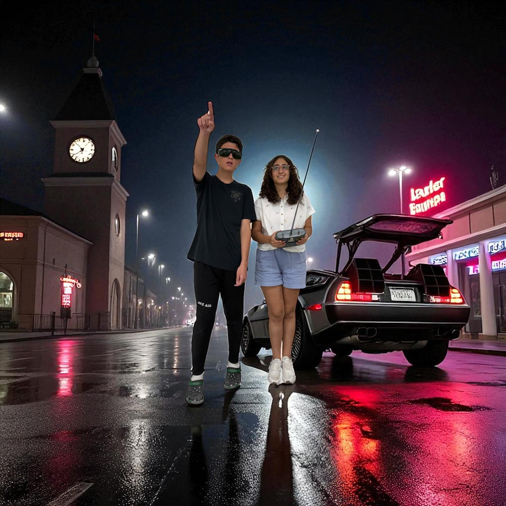

Team BACK TO THE FUTURE - WRO® 2025 Future Engineers
---
<table border="0">
  <tr border="0">
    <td  border="0" colspan="2">
      
    </td>
  </tr>
  <tr border="0">
    <td width="65%"  border="0">
      
      
    </td>
    <td valign="top" style="padding-left: 0px;" border="0">
        This repository details team <em>Back To The Future</em>'s building and programming process in the 2025 WRO Future Engineers Competition. 
      We are team <em> Back To The Future</em>, two students who are passionate about technology and robotics. For this competition we built an autonomous vehicle. We worked after school and on weekends. Through this competition, we learned how to work as a team and solve problems related to robotics.
       

        <strong>Team Members:</strong>
      <ul>
        <li>Ayça Nisa Çerçi, 16</li>
        <li>Batuhan Pekcan, 15</li>
      </ul>
      

    </td>
  </tr>
</table>

  

## Table of Contents
- [Folder Contents](#folder-contents-)
- [The Challenge](#challenge)
- [Vechile](#Vechile)
- [Hardware Components](#Hardware)
- [Software Components](#Software)
- [Robot Construction Guide](#robot-construction-guide-)
- [Resources](#Resources)
- [License](#License)

## Folder Contents 
* `models` is for the 3D files we used to print our parts
* `other` includes other files which can be used to understand how to prepare the vehicle for the competition. It includes documentations, datasets, hardware specifications, communication protocols,  descriptions etc.
* `schemes` contains schematic diagrams of the electromechanical components illustrating all the elements (electronic components and motors) used in the vehicle and how they connect to each other.
* `src` contains code of control software for all components which were programmed to participate in the competition
* `t-photos` contains photos of the team and logos
* `v-photos` contains 6 photos of the vehicle from various angles
* `video` contains the video.md file with the link to our YouTube channel and the respective videos

## The Challenge 

In the **[WRO 2025 Future Engineers – Self-Driving Cars](https://wro-association.org/)** category, teams are tasked with creating a robotic vehicle that can autonomously navigate a changing racetrack. Each round introduces new track layouts, requiring vehicles to adapt in real time.
The competition highlights the full engineering process:

- **Vehicle Design**: Building a functional robot with electromechanical components and advanced steering or motion systems.
- **Obstacle Management**: Applying computer vision, sensor fusion, and motion planning to make real-time decisions.
- **Project Documentation**: Maintaining an engineering journal and sharing designs in a public GitHub repository.

Teams are judged on performance, innovation, reliability, and the clarity of their engineering process, encouraging creativity, teamwork, and STEM skills.

Learn more about the challenge [here](https://wro-association.org/wp-content/uploads/WRO-2025-Future-Engineers-Self-Driving-Cars-General-Rules.pdf).

## Vechile 
Our robot integrates LEGO components with custom 3D-printed hardware, designed to maximize stability and durability. It features a 3D-printed motor mount and camera holder, integrated with a LEGO-based chassis. For steering, we implemented a simplified Ackermann setup without linkage geometry (reckless steering), allowing the robot to turn easily while keeping the design compact. Our robot is powerized 

### V-Photos 
|  |  | 
| :--: | :--: | 
| *Front* | *Back* |
|  |  | 
| *Left* | *Right* |
|  |  | 
| *Top* | *Bottom* |

 

## Hardware Components 

## Software Components 

## Robot Construction Guide 

## Resources 

## License 
